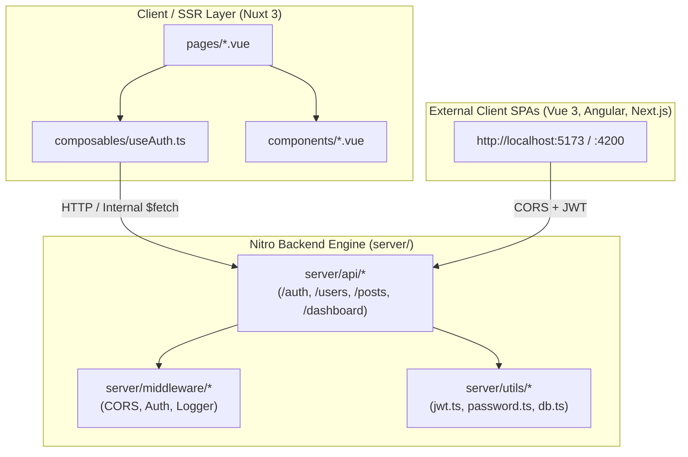

# Nuxt 3 Engineering Handbook & Architectural Standard

This handbook is the definitive source of truth for architectural boundaries, design patterns, and philosophies of the **Nuxt 3 Nitro Master Template (`nuxt-template-v2`)**.

---

## 1. Architectural Philosophy

- **Unified Fullstack Efficiency**: Nuxt 3 bridges the client SSR/CSR layer with a high-performance, standalone Nitro backend engine.
- **Predictability over abstraction**: Explicit TypeScript contracts validated by Zod at every API boundary.
- **Micro-service & Cross-Origin Ready**: The Nitro backend serves both native Nuxt SSR views and external frontend SPAs (Vue 3, Angular, React) via CORS and JWT authentication.
- **Dual State Segregation**: Server State is managed with Nuxt `useFetch` / `useAsyncData` (or TanStack Query), while Client UI & Session state is encapsulated in `@pinia/nuxt` and secure cookies.

---

## 2. Layered Nitro & Nuxt Architecture

---

## 3. Server API Architecture

1. **`server/api/auth/`**:
   - `login.post.ts`: Validates email/password with `bcrypt.compare` and issues HMAC SHA-256 JWT Access & Refresh token pairs.
   - `register.post.ts`: Salted password hashing (10 rounds) and new user onboarding.
   - `me.get.ts`: Extracts and verifies `Authorization: Bearer <token>`, returning the authenticated identity payload.
   - `refresh.post.ts`: Rotates token sessions and prevents token reuse attacks.
   - `logout.post.ts`: Invalidates active refresh sessions.

2. **`server/middleware/cors.ts`**:
   - Manages preflight `OPTIONS` requests and sets CORS headers for all client origins (`localhost:5173`, `localhost:4200`, etc.).

---

## 4. State Management Protocol

- **Session State**: Managed via `useAuth.ts` and `useCookie` with `httpOnly`/`SameSite` security attributes.
- **Server Cache**: Automatic deduplication and caching using `useFetch` with query key hashing.
